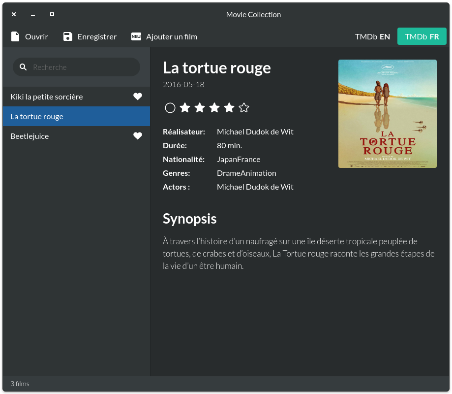
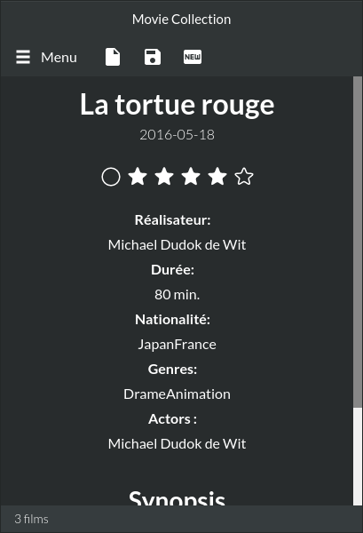

# Simple Movie Collection app
(currently in beta and under heavy development)

Simple application for managing your personnal movie collection. Can also fetch informations from TMDb.

Available on 🐧 Linux 💻 Windows 🤖 Android

-> To import your current GCStar/GCFilms collection, look at the import section.

 


Debugging Desktop :
-------------------

```sh
npm install

npm run serve   (keep terminal open)

npm run electron   (or using vscode "Electron Debug")
```

Linux: Error "ENOSPC" : (max watch files limit exeed)
```sh
echo fs.inotify.max_user_watches=524288 | sudo tee -a /etc/sysctl.conf && sudo sysctl -p
```


Debugging Android :
-------------------

Install latest JDK/OpenJDK package `java-1.8.0-openjdk-devel`

Install [latest Android SDK](https://developer.android.com/studio/#command-tools) (currently v28)

Inkscape command-line must also be on PATH in order to create mipmaps from SVGs

```sh
npm run serve   (keep terminal open)

./android.sh test      (or just 'install' if you dont want to debug logs)
```

It will create mimaps (if needed), compile, sign, launch the APK using ADB and show console logs.

Watch-out for Chrome versions when building for different API -> add targets to `.babelrc`
(eg: default Android 23 with Chrome 51 don't support async/await)


Build Desktop :
---------------

```sh
npm install

npm run build-linux32  (choose your arch)
npm run build-linux64
npm run build-win32
npm run build-win64
npm run build-mac  (not tested!)
```

Release executable will be in `/release-builds/` folder

Linux: missing `libXss.so.1` library -> Install `libXScrnSaver` package


Build Android :
---------------

Report to "Debugging Android" section for requirements.

```sh
npm run bundle && ./android.sh
```

Release APK will be `/android/apk/simplemoviecollection.apk`


Import from GCStar/GCFilms
--------------------------

Install nodejs package and run :

```sh
node ./import-gcstar.js mycollection.gcs  [destination.json]
```

[x] Then copy all your posters inside a "/posters/" folder, the hierarchy must look like this :

- your-collection.json
- posters/
    - superposter.jpg
    - superposter2.jpg
    - etc...


[x] How to use the converted collection to Android :

- copy the file to your sdcard : `/Android/data/fr.spidery.moviecollection/moviecollection.json`
- copy all the posters inside `/Android/data/fr.spidery.moviecollection/posters/`

/!\ On Android, the document's name __must be__ `moviecollection.json`

the hierarchy must look like this :

- /Android/data/fr.spidery.moviecollection/
    - moviecollection.json
    - posters/
        - superposter.jpg
        - superposter2.jpg


Credits :
---------

[Lato Fonts](http://www.latofonts.com/lato-free-fonts/) - SIL Open Font License

[GNOME Adwaita Icons](https://github.com/GNOME/adwaita-icon-theme) - GPL v2

[Star rating script](https://codepen.io/mburnette/pen/eNNZbm) - MIT

[Electron IPC Logger](https://github.com/ungoldman/electron-ipc-log) - ISC License

[Android Build tool](https://medium.com/@authmane512/7260e1e22676)

Icons :

Godzilla made by [Freepik](https://www.flaticon.com/authors/freepik) from [www.flaticon.com](https://www.flaticon.com) is licensed by [CC 3.0 BY](http://creativecommons.org/licenses/by/3.0/)

Clapperboard made by [Roundicons](https://www.flaticon.com/authors/roundicons) from [www.flaticon.com](https://www.flaticon.com) is licensed by [CC 3.0 BY](http://creativecommons.org/licenses/by/3.0/)


## License

[MIT License](LICENSE)

